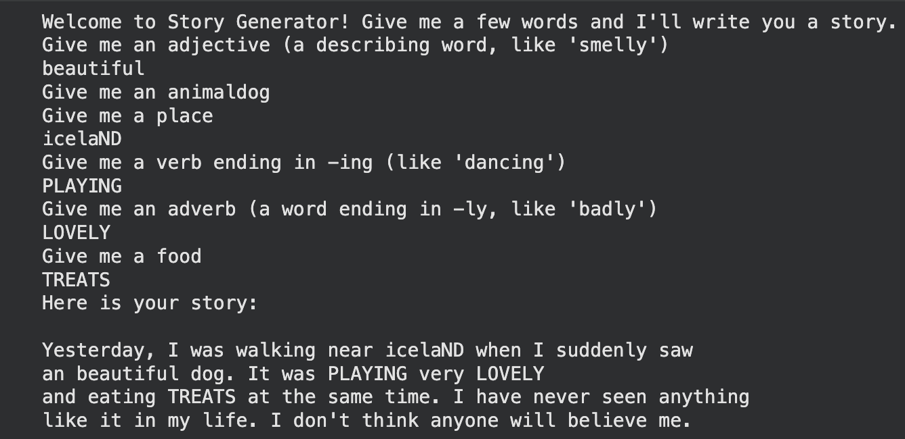

# Python Story Generator

## Description
A beginner Python project that generates a fun story based on user inputs. This project helped me practice Python fundamentals such as variables, user input, and f-strings.

## Features
- Takes multiple user inputs
- Generates a unique story
- Uses Python f-strings for formatting

## Concepts Practiced
- Variables
- User Input (`input()`)
- String Formatting
- f-Strings
- Print Statements

## How to Run

1. Clone this repository.
2. Open the project in your preferred Python environment.
3. Run:

```bash
python storygenerator.py
```

## Sample Output



## Author
Sajith John Kaleekkal
